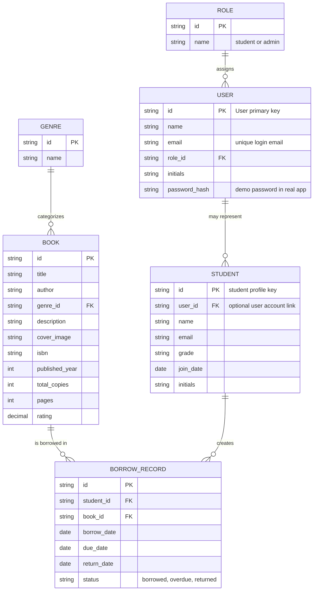
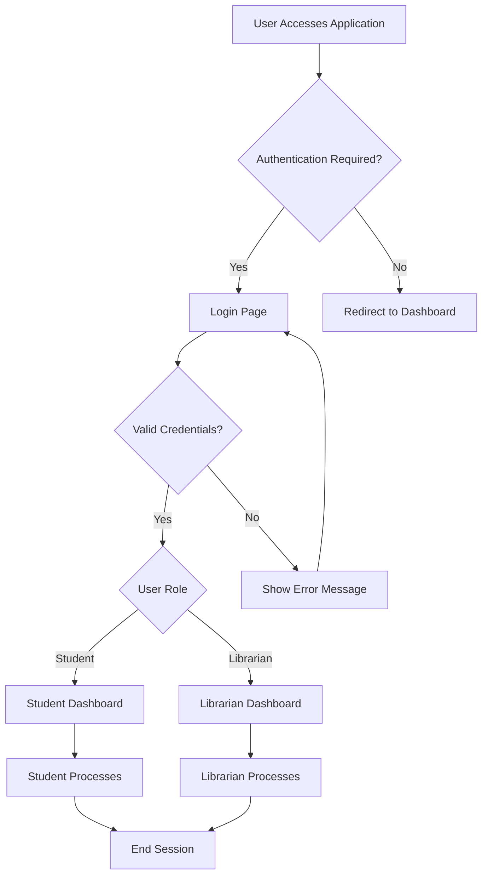
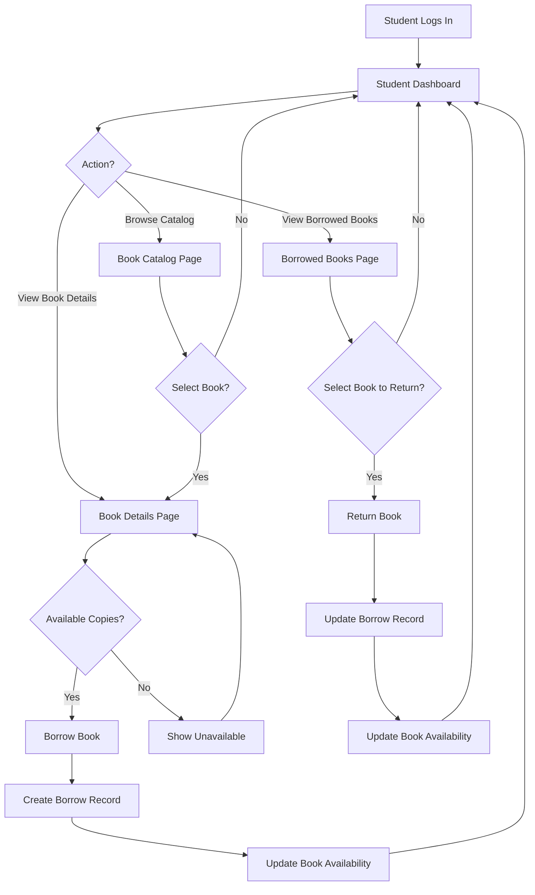
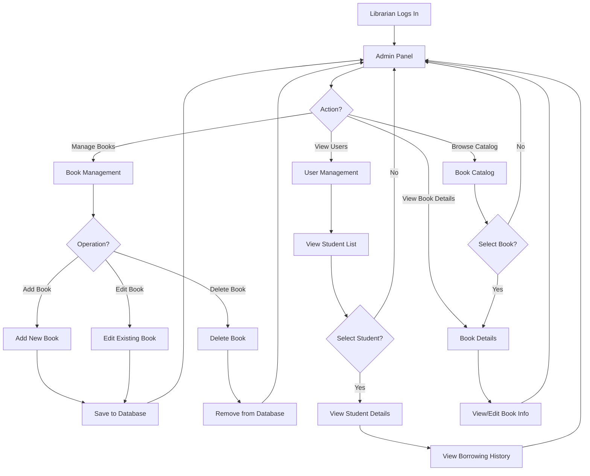

# EduLib Entity Relationship Diagram (ERD)

This document describes the normalized data model and user flow for the EduLib library management UI.
It includes the authentication flow, student and librarian processes, and a Mermaid crow's foot ERD.

## Mermaid Crow's Foot ERD

## Process Flow Diagrams

### Overall System Flow

### Student Process Flow

### Librarian Process Flow

## Entity Descriptions

- `USER`
  - Represents application accounts used for login and role selection.
  - In the current code, demo login uses `student@school.edu` and `librarian@school.edu` with `password123`.
  - The `role_id` connects to `ROLE` for student or librarian access.

- `ROLE`
  - Defines the type of access: `student` or `admin`.
  - This keeps role logic separate and supports 4NF by avoiding repeated multi-valued role data.

- `STUDENT`
  - Captures student profile details and registration metadata.
  - In a normalized design, student profiles are separate from authentication accounts.

- `GENRE`
  - Normalizes book categories so repeated genres are stored once.
  - This avoids repeated textual genre values in `BOOK`.

- `BOOK`
  - Stores the library's catalog metadata.
  - Copy counts are stored as attributes; availability may be derived from borrow records in a fully transactional system.

- `BORROW_RECORD`
  - Tracks each borrowing transaction between a student and a book.
  - The status field maintains the lifecycle: `borrowed`, `overdue`, or `returned`.

## Normalization Notes (1NF, 2NF, 3NF, 4NF)

1. First Normal Form (1NF)
   - All tables contain atomic values.
   - Each record has a unique primary key.
   - No repeating groups or arrays are stored in columns.

2. Second Normal Form (2NF)
   - Every non-key attribute fully depends on the table's primary key.
   - `BORROW_RECORD` uses a single key `id`, and all fields describe that borrowing event.
   - `BOOK` attributes describe only the book itself.

3. Third Normal Form (3NF)
   - No transitive dependencies exist between non-key attributes.
   - `GENRE` is separated from `BOOK` so book category text is not duplicated.
   - `ROLE` is separated from `USER` so role names are not repeated inconsistently.

4. Fourth Normal Form (4NF)
   - No table contains more than one independent multi-valued fact.
   - Each relation captures one relationship type: user-role, student, book-genre, book borrow.
   - The design avoids multi-valued dependencies by storing genre, role, and borrow details in separate tables.

## Application Flow

### Authentication Flow

1. User lands on `LoginPage.tsx`.
2. The login form submits to `AuthContext`.
3. `AuthProvider` verifies credentials and sets `user` state.
4. If the account is the student demo user, the app navigates to `/student`.
5. If the account is the librarian demo user, the app navigates to `/admin`.
6. If authentication fails, the login page shows an error.

> Note: The current code does not implement a signup page. A normalized registration flow would create a new `USER` record and optionally a linked `STUDENT` record.

### Student Process

- After signing in, the student sees `StudentDashboard.tsx`.
- The dashboard displays:
  - active borrowed count
  - overdue count
  - total borrowed
  - available books count
  - search form and category links.
- The student can browse the catalog via `BookCatalog.tsx`:
  - search, filter by genre, sort, and toggle grid/list.
- The student can open `BookDetails.tsx`:
  - view book metadata, availability, description, and related books.
  - borrow a book if copies are available.
- Borrowing creates a new `BORROW_RECORD` and reduces `available_copies` for the `BOOK`.
- The student can view `BorrowedBooks.tsx`:
  - filter active, overdue, or returned records.
  - return borrowed books, which updates the borrow record and inventory.

### Librarian/Admin Process

- After signing in, the librarian sees `AdminPanel.tsx`.
- The admin dashboard shows:
  - collection statistics, active borrow count, overdue counts.
  - a searchable and filterable book table.
- The librarian can manage books:
  - add new books
  - edit existing book records
  - delete books
- The librarian can view `UserManagement.tsx`:
  - student account summary
  - borrowing history and overdue status
  - filter students by name, email, or grade

## Page Map

- `/` → `LoginPage`
- `/student` → `Layout` → `StudentDashboard`
- `/student/catalog` → `BookCatalog`
- `/student/book/:id` → `BookDetails`
- `/student/borrowed` → `BorrowedBooks`
- `/admin` → `Layout` → `AdminPanel`
- `/admin/books` → `AdminPanel`
- `/admin/users` → `UserManagement`
- `/admin/catalog` → `BookCatalog`
- `/admin/book/:id` → `BookDetails`

## How to Use This File

- Open this file in a Markdown preview or Mermaid live editor to render the diagram.
- The diagram is written in Mermaid ERD syntax for crow's foot notation.
- Use it as a reference for implementing a normalized database schema or building a backend API layer.
